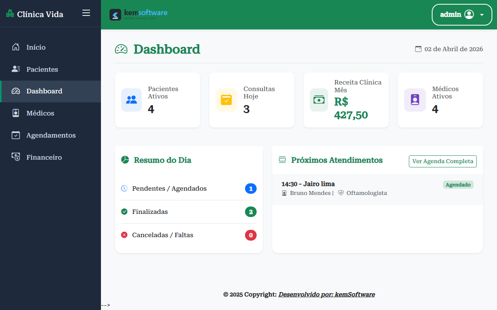
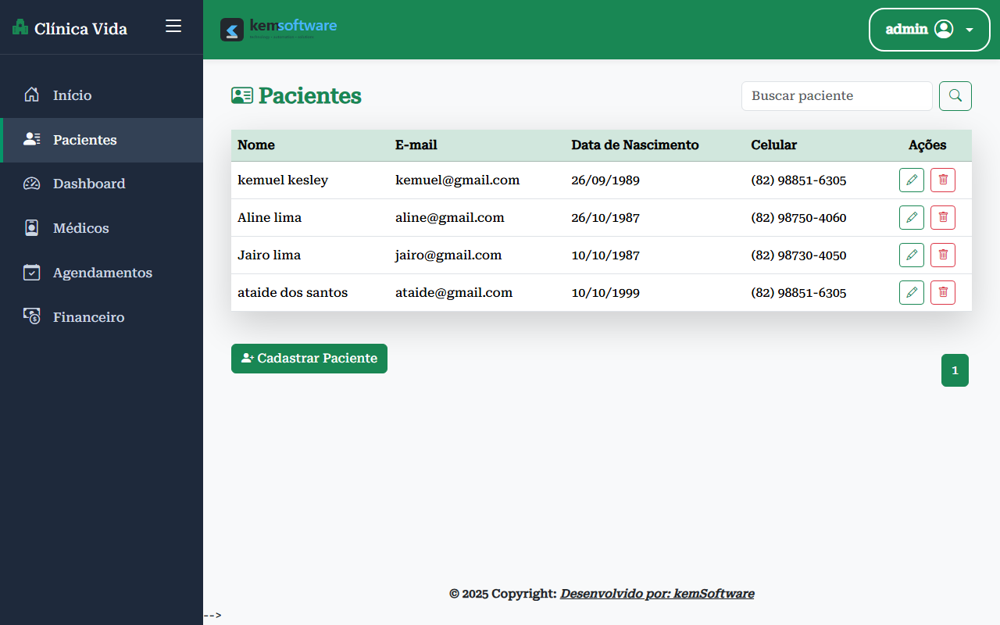
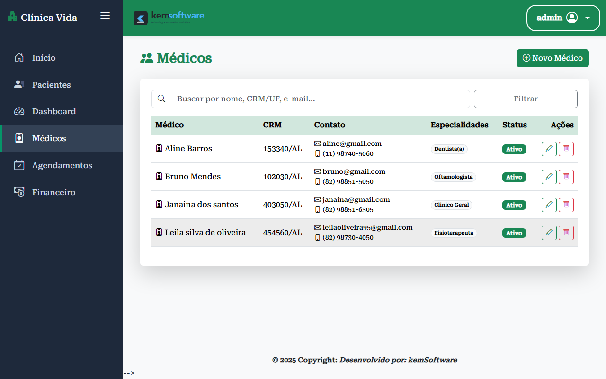
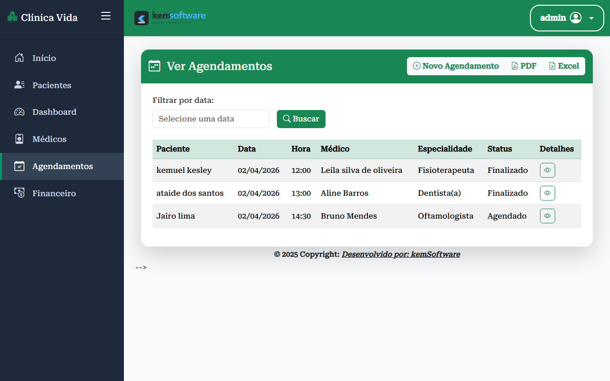
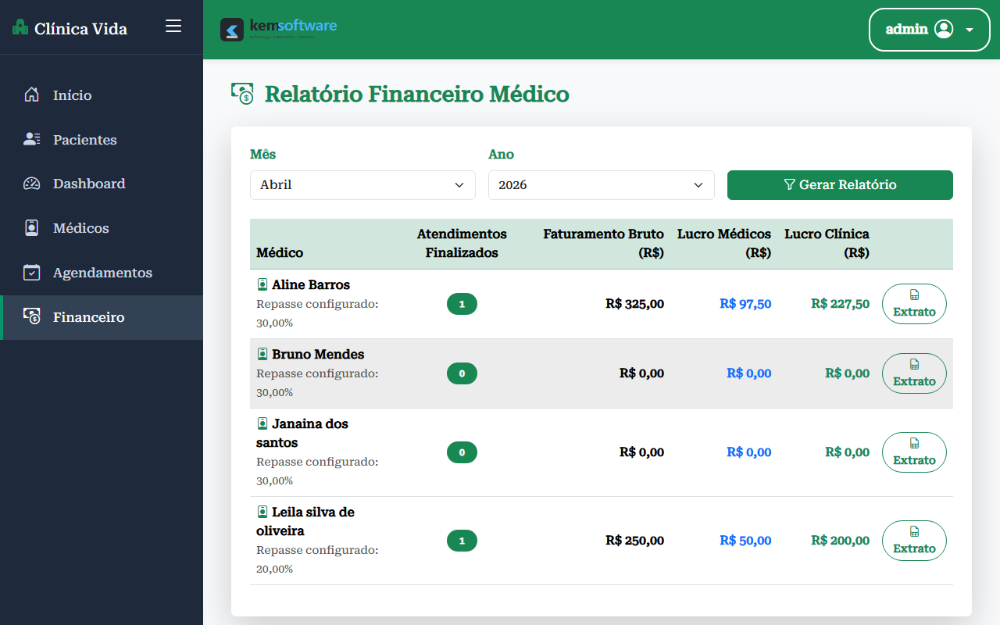

# Sistema de Gestão de Clínica 🏥

Sistema completo para a gestão de clínicas médicas, permitindo o cadastro de pacientes, médicos, controle de agendamentos e gestão financeira.


## ⚙️ Funcionalidades

- CRUD completo de pacientes  
- CRUD completo de médicos  
- Sistema de agendamento de consultas com controle de status  
- Envio de notificações automatizadas via WhatsApp  
- Dashboard com indicadores operacionais e financeiros  
- Envio de notificações automatizadas via WhatsApp  
- Módulo financeiro com cálculo de repasse médico  
- Geração de relatórios imprimíveis  
- Script para geração de dados fictícios  

---

## 🧱 Arquitetura

A aplicação foi desenvolvida utilizando o padrão **MTV (Model-Template-View)** do Django, garantindo uma separação clara de responsabilidades entre as camadas do sistema.

- **Models:** Responsáveis pela estrutura e regras de negócio dos dados  
- **Views:** Responsáveis pela lógica da aplicação e integração entre frontend e backend  
- **Templates:** Responsáveis pela renderização das interfaces  

---


## 🛠️ Tecnologias Utilizadas

- Python  
- Django  
- PostgreSQL (Supabase)  
- HTML / CSS  
- JavaScript  
- Git / GitHub  
- Integração com API de CEP (busca automática de endereço)  

---


## 🚀 Como Rodar o Projeto

Siga o passo a passo abaixo para configurar e executar o sistema localmente:

### 1. Pré-requisitos
- Python instalado na sua máquina.
- Banco de Dados PostgreSQL (o projeto utiliza Supabase por padrão).

### 2. Configurando o Ambiente
Crie e ative um ambiente virtual:
```bash
python -m venv venv

# No Windows
venv\Scripts\activate

# No Linux ou Mac
source venv/bin/activate
```

Instale as dependências do projeto:
```bash
pip install -r requirements.txt
```

### 3. Variáveis de Ambiente
Crie um arquivo `.env` na raiz do projeto, baseado no arquivo de exemplo existente:
```bash
cp .env.example .env
```
Abra o arquivo `.env` e preencha a variável `DATABASE_URL` com as suas credenciais do banco de dados relacional e a sua `SECRET_KEY`.

### 4. Preparando o Banco de Dados
Execute as migrações do Django para criar as tabelas no banco de dados e aplicar o esquema da aplicação:
```bash
python manage.py migrate
```

**(Opcional)** Você pode popular o sistema com dados fictícios para visualizar como o sistema se comporta preenchido:
```bash
python criar_dados_fakes.py
```

### 5. Criando o Usuário Administrador
Para conseguir fazer login na plataforma, você precisa criar o seu usuário principal:
```bash
python manage.py createsuperuser
```
*(Siga os passos solicitados no terminal para definir seu nome de usuário e senha)*

### 6. Executando o Servidor
Com tudo pronto, inicie o servidor local:
```bash
python manage.py runserver
```
Acesse `http://localhost:8000` no seu navegador e faça o login com o acesso criado!

---

## 📸 Conhecendo o Sistema

Abaixo você encontra painéis demonstrativos apresentando e explicando as principais interfaces da aplicação:

### 1. Tela de Login
Interface inicial protegida. Exige que os profissionais de administração/saúde se autentiquem com segurança para acessar a plataforma.


### 2. Dashboard
Painel central e principal da clínica. Fornece métricas rápidas em um piscar de olhos, como o balanço financeiro diário, a média de consultas do período e a relação dos últimos agendamentos para rápido acompanhamento.


### 3. Pacientes
Gestão integral de contatos. Esta tela lista e permite adicionar novos usuários a base de dados, bem como editar cadastros existentes de pacientes com todos os seus dados biométricos.


### 4. Médicos
Diretório do corpo clínico. Contém o registro de todos os doutores associados à clínica, controlando também a porcentagem de repasse (comissão) estabelecida em contrato.


### 5. Agendamentos
Controle central de rotina médica. Permite visualizar em formato tabular todas as marcações de consultas, divididas por status de confirmação (Pendente, Consulta Finalizada, Cancelada).


### 6. Financeiro
Módulo de cálculo de faturamento. Avalia os lucros brutos gerados pela clínica, detalhando quanto cada parcela será direcionada à clínica e as comissões individuais de cada médico prestando serviço baseadas nas consultas realizadas.

